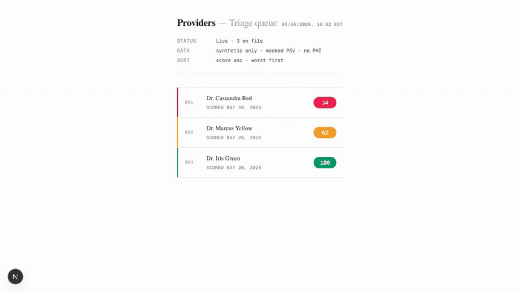

# PacketReady

Hi Jake — this is the take-home from our conversation. Built solo
over 5 days. The 26-second demo below is the fastest way in; the
eval numbers further down are the honest answer to "does it work."

Higher-fidelity recordings:
[mp4](https://github.com/benjaminematton/PacketReady/releases/download/demo-v1/demo.mp4)
or the [release page](https://github.com/benjaminematton/PacketReady/releases/tag/demo-v1)
(mp4 + source webm attached). Re-record locally with `npm run tour`
from [tools/demo-tour/](tools/demo-tour/).

Two companion artifacts to read alongside this README:

- **[docs/design.md](docs/design.md)** — full design, decision tree,
  alternatives rejected, row-by-row competitor verification.
- **[docs/build-plan.md](docs/build-plan.md)** — phase-by-phase build
  log (phases 0–4 closed; phase 5 designed, not built).

## Why this build

The brief was open-ended, so the most important decision was scope.
Here's how I narrowed it.

Atano's homepage promises five primitives — document intelligence,
primary source verification, payer auto-fill, real-time reporting, and
smart follow-ups — plus the bottom-line claim that providers get
"approved the first time, every time." The seam I picked is that
promise. The five primitives are all collection-side or
post-credentialing surfaces; none of them is *cross-document validation
against payer-readiness criteria before submission*. That's where
first-time denials get prevented, and it's the part of Atano's pitch
that doesn't have a marketed feature behind it yet.

A few alternatives I considered and rejected:

- **A better document triage classifier than your filename regex.**
  Rejected because you told me regex is fine for that — building a
  fancier version is solving a problem you don't think you have.
- **An end-to-end provider intake portal.** Rejected because Verifiable
  ships this (their Provider Intake module + CredAgent's 150-step
  pipeline), Medallion ships this, Assured ships this. A weekend MVP
  in a crowded lane.
- **An eval harness for your existing extraction pipeline.** Rejected
  as standalone because it's a measurement tool, not a product slice
  — though I built one as part of this anyway.

PacketReady picks up after extraction and before submission. The
intake half exists to feed the score half realistic noisy data; the
score half is the differentiated product.

## What's actually shipped

- Sonnet-based per-doc extractors (license / DEA / malpractice / board
  cert) with confidence-weighted outputs and bbox-level citations.
- Eight cross-document validators (4 rule-based, 2 LLM-augmented,
  2 payer-aware via per-payer YAML config).
- 0–100 readiness score with Critical / Major / Minor breakdown and
  per-issue remediation pointing back to the source PDF region.
- Operator dashboard with worst-first triage and per-provider audit
  timeline reconstructed from append-only events.
- Full Langfuse observability across classification, extraction,
  validation, score synthesis.
- 50-packet synthetic eval set, run end-to-end through the
  orchestrator, with weighted Cohen's κ = 0.68 against 20 hand-labeled
  tier judgments.

## What's deliberately out of v1

- **The intake agent itself.** The state machine, magic-link portal,
  and Postmark-style outbox are designed in
  [docs/design.md](docs/design.md) but stubbed for v1 — admin uploads
  documents directly on the provider's behalf, and multi-turn loops are
  simulated. Full intake is the natural Phase 5 build; design is locked.
- **Real CAQH ProView, NPPES, OIG, SAM, state board integrations.**
  Mocked behind a `lookup_primary_source` contract; live PSV is a
  separate uplift.
- **Browser-driven payer portal submission.** Atano markets this; not
  the differentiator.
- **Production authn/authz.** Magic-link only.
- **HIPAA-compliant deployment.** Synthetic data only.

If I were joining and shipped this from day one, the first 30 days
would be: real CAQH integration, the Postmark outbox + magic-link
intake (the Phase 5 path), and a second labeler on the eval set to
move κ from a self-consistency upper bound to a real one.

## Accuracy

Two complementary number sets live here. The **full-pipeline baseline**
measures the system end-to-end against the 50-packet dataset — every
PDF goes through classification, extraction, validators, and score
synthesis as it would for a real submission. The **prompt-isolated
tuning** numbers measure individual LLM-validator prompts against
`golden.json` inputs directly, bypassing extraction. The first answers
"does the system work"; the second isolates "is the prompt right."
Both belong in the README; comparing the two diagnoses where any gap
lives (extraction vs validator).

### Full-pipeline baseline

[`evals/results/baseline.json`](evals/results/baseline.json), 50 packets,
~520 seconds wall-clock at concurrency=3.

**Conflict precision / recall (per planted kind):**

| Kind                            | Planted | Caught | Fabricated | Precision | Recall |
|---|---:|---:|---:|---:|---:|
| `name_variant`                  | 9       | 6      | 0          | 1.00      | 0.667  |
| `taxonomy_specialty_mismatch`   | 8       | 8      | 3          | 0.727     | 1.0    |

A planted conflict is "caught" iff all three predicates hold against
at least one emitted Issue: (1) the Issue's `validator` matches the
expected validator for the kind, (2) the Issue's citations name at
least one planted source via documentId→docType resolution, and (3)
the Issue's `field` discriminator matches the planter's field. The
3-predicate check rules out "right validator, wrong finding" from
counting — see
[`evals/runners/runners/conflict_metrics.py`](evals/runners/runners/conflict_metrics.py).

**Score / tier distribution:**

| Tier   | Count | Definition         |
|---|---:|---|
| Green  | 20    | score ≥ 85         |
| Yellow | 24    | 60 ≤ score < 85    |
| Red    | 6     | score < 60         |

Mean score 80.3, range 22–100 across 50 successful packets (0 errors).

**Tier agreement (κ + 3×3 confusion, n=20):**

20 packets hand-labeled in
[`evals/labels/human_tiers.json`](evals/labels/human_tiers.json) and
run through [`agreement.py`](evals/runners/runners/agreement.py).
Stratified across all four base buckets (clean, scanned,
name-variant, taxonomy-mismatch) to keep the confusion matrix
non-degenerate. Labeler tier distribution: 8 Green, 2 Yellow, 10 Red.

| Metric                              | Value      | Floor                                          |
|---|---:|---|
| Weighted Cohen's κ (quadratic)      | **0.6786** | Landis-Koch substantial 0.61; target 0.50      |
| Raw agreement                       | 0.55       | 11 / 20 exact matches                          |
| Spearman ρ (score vs ordinal tier)  | 0.7455     | continuous footnote, not headline              |

3×3 confusion (rows = human tier, cols = system tier):

|           | Red | Yellow | Green |
|---|---:|---:|---:|
| **Red**    | 2 | 8 | 0 |
| **Yellow** | 0 | 2 | 0 |
| **Green**  | 0 | 1 | 7 |

**System trends conservative on Red.** 8 of 10 human-Red packets
came back system-Yellow; the system never returned Red for a
human-Green case, and never Green for a human-Red. The κ holds at
0.68 only because off-by-one slips dominate over catastrophic swaps
under quadratic weighting. A reader interpreting the score should
know: *the system underreaches on critical blockers relative to a
human labeler*. The fix is rubric reweighting on Critical issues —
named for the post-launch follow-on.

**Why some "clean" buckets read Red.** The dataset generator anchors
every packet's dates to `_NEW_PACKET_ANCHOR = 2026-05-25`. When the
per-packet RNG draws `rng=3` on the DEA-issue offset, the DEA expires
exactly on the anchor date — yesterday from the perspective of any
`today > 2026-05-25`. Hits ~1/3 of clean / scanned packets (Hall,
Flores, Rice, Tucker in the n=20 subset). Treated as a feature, not a
bug: it gives the eval Red samples outside the planted-conflict
buckets, which is what keeps κ from going degenerate. Documented in
[`docs/impl/phase-4-scale-and-llm-validators.md`](docs/impl/phase-4-scale-and-llm-validators.md)
under risks/open.

**Tuning surfaces:**

- `name_variant` recall ceiling at 0.667 with FP=0 means the prompt is
  conservatively-tuned — 3 must-flag planted shapes pass without
  emission. The IdentityCoherence v1 prompt was tuned on the 10-packet
  subset to prioritize FP discipline; the held-out 3 misses are the
  expected cost. Bumping recall here is the next tuning loop, not a
  bug.
- `taxonomy_specialty_mismatch` precision 0.73 reflects 3 LLM judgments
  that flag legitimate specialty/taxonomy synonymies as mismatches.
  Follow-on tuning surface — the NUCC compare prompt is a v1 ship.

### IdentityCoherence prompt-isolated tuning

These numbers measure the IdentityCoherence prompt against
`golden.json` fullName values directly via
`tools/TuneIdentityCoherence` — no PDFs, no classifier, no Sonnet
extractor. They tell you whether the prompt would catch a disagreement
*given* a correctly-extracted name set; the full-pipeline baseline
above tells you what happens when extraction is in the loop. Recall on
the full pipeline (0.667) sits below the prompt-isolated number (100%)
— the gap measures extraction noise + provenance routing, not prompt
quality. Source data:
[`evals/tuning-runs/iter-100__*.json`](evals/tuning-runs/), prompt SHA
`48322ce7`, 50 packets × 3 runs, worst-of.

False-positive rate on the 30 conflict-free + 3 don't-flag packets:

|                       | Rate |
|---|---|
| **FP rate**           | **0.0%** (0 fabrications across 30 clean + 3 don't-flag packets) |

Recall by planted name-disagreement shape (must-flag totals across the 50-packet set):

| Shape               | Caught | Notes |
|---|---|---|
| HYPHENATED_SUFFIX   | 3 / 3  | `"Jane Calloway"` → `"Jane C. Calloway-Smith"` |
| MIDDLE_NAME_ADDED   | 2 / 2  | `"John Bartlett"` → `"John James Bartlett"` |
| NICKNAME            | 2 / 2  | `"Robert Anderson"` → `"Bob Anderson"` |
| SURNAME_SWAP        | 2 / 2  | `"Anderson"` → `"Bautista"` |
| SURNAME_TYPO        | 0 / 2  | One-letter typo — correctly **not flagged** (don't-flag shape) |
| **Total must-flag** | **9 / 9 (100%)** |  |

Tuning converged in two instruction-level iterations from baseline
FP=16.7% / recall=75% to FP=0% / recall=100% on the tuning subset. The
[full iteration log](evals/tuning-runs/) and the
[per-iteration failures TSV](evals/tuning-runs/iter-00__failures.tsv)
record exactly which rule changes moved which category. Held-out 10
(disjoint from the tuning subset, drawn from the 50 with `seed=9999`)
ran 3 times and matched the in-sample numbers — no overfit.

### Bias caveat (read this before citing the numbers)

The hand-labeled fixtures, the IdentityCoherence and NpiTaxonomyMatch
prompts' do-flag / don't-flag rules, the iteration decisions during
prompt tuning, and the 20-packet Red/Yellow/Green tier labeling were
all made by the same person. The published numbers measure how well
the system reproduces that one person's credentialing judgment, not
how well it tracks an independent ground truth.

A second labeler — and a second prompt reviewer — would push the bound
on these from upper to honest. Both are post-launch asks. Honest
readings:

- **`name_variant` precision 1.0, recall 0.667** — "the validator emits
  only the disagreements the prompt-author would have called out, and
  emits them on the planter shapes the prompt was tuned for." Not "the
  validator catches every real-world name disagreement a credentialing
  admin would flag."
- **`taxonomy_specialty_mismatch` precision 0.73** — "the LLM compare
  step judges some legitimate specialty/taxonomy synonymies as
  mismatches when a credentialing expert wouldn't." Worth a second
  prompt reviewer.
- **Tier agreement κ = 0.6786 (n=20)** — measures self-consistency
  between the validator suite and the labeler-in-the-validator-author's-head,
  not ground truth. Read it as an upper bound on agreement with an
  independent expert. Two structural facts: (1) the labeler is also
  the validator-rule author, and (2) the labeler is not a working
  credentialing admin. The system's tendency to come back Yellow on
  human-Red cases (the 8/10 cell of the matrix above) is itself
  informative: a credentialing admin might call the labeler
  conservative, or might call the system permissive, depending on
  whose rubric anchors the conversation. The `_biasNote` field in
  [`human_tiers.json`](evals/labels/human_tiers.json) carries this
  in-band; the baseline's `agreement.biasNote` carries it through to
  the regression-gate payload.

### Competitor positioning

The defensible column intersection — pre-CAQH intake + cross-document
validation + a published readiness score + a cited audit trail +
published accuracy numbers — is shipped by **no single competitor** as
of the 2026-05 marketing-surface verification in
[docs/design.md §Appendix A](docs/design.md#appendix-a--comparison-to-competitors).
That appendix carries the row-by-row verification (each "✓" or
"partial" sourced to a competitor's homepage) and a per-row reading
notes block documenting what every "—" represents. The full table is
narrower than the marketing copy suggests for several competitors —
deliberately so.

## Local setup

See [docs/local-setup.md](docs/local-setup.md) for prerequisites,
bring-up steps, the Phase 0 smoke-test gate, repo layout, and common
dev commands.
